## Bill of Materials for DBV2

The trip begins with acquiring the parts. Here, we provide a link to all bits and pieces that are needed to build a Duckiebot, along with their price tag. If you are wondering what is the difference between different Duckiebot configurations, read [this](#duckiebot-configurations).

In general, keep in mind that:

- The links might expire, or the prices might vary.
- Shipping times and fees vary, and are not included in the prices shown below.
- Substitutions are OK for the mechanical components,
  and not OK for all the electronics, unless you are OK in writing
  some software.
- Buying the parts for more than one Duckiebot makes each one cheaper than buying only one.
- For some components, the links we provide contain more bits than actually needed.

Requires: Cost: USD 150 + Shipping Fees   

Requires: Time: 15 days (average shipping for cheapest choice of components)  

Results: A kit of parts ready to be assembled in a `DBV2` configuration.  

Next steps: After receiving these components, you are ready to do some [soldering](#soldering-boards-c0) before [assembling](#assembling-duckiebot-db17-ttic) your `DBV2` Duckiebot.

## Materials
| Part   | Price          |
| :----- | :-------------  |
|[Chassis](https://www.amazon.com/Tamiya-70112-Buggy-Car-Chassis/dp/B002DR3H62/ref=br_lf_m_7x64hsptfvee7uz_img?_encoding=UTF8&s=toys-and-games)     |  USD 20.94     |
|Chassis - Laser Cut | Ask JT |
|[Camera with 160-FOV Fisheye Lens](https://tinyurl.com/ybwrcywc) |USD 22|
|[Camera Mount](https://tinyurl.com/ybyewdrt)|                        USD 8.50|  
|[300mm Camera Cable](https://www.adafruit.com/product/1648) |USD 2 |
|[Raspberry Pi 3 - Model B+](https://tinyurl.com/ycsujzb9) |USD 35 |
|[Power supply for Raspberry Pi](https://www.adafruit.com/product/1995)|USD 7.50 |
|Microcontroller Board | Ask JT |
|[Servo Motor](https://www.pololu.com/product/1051) |USD 9.95 |
| [Heat Sinks](https://tinyurl.com/yanradnp) |USD 2.90 |     
|[16 GB Class 10 MicroSD Card](https://tinyurl.com/ydawrgdx) |USD 10 |
|[Mirco SD card reader](https://www.adafruit.com/product/939 ) |USD 6 |
|[Battery](https://www.amazon.com/dp/B01K702S66/ref=emc_b_5_t)  |USD 25.99 |
|[USB to microUSB](https://www.amazon.com/CableCreation-Triple-Shielded-Charger-Android/dp/B013G4EAEI/ref=sr_1_20?s=electronics&ie=UTF8&qid=1532016619&sr=1-20&keywords=usb+to+micro+usb+cable) |USD 4.99 |
|[22 Nylon Standoffs (M2.5 12mm F 6mm M)](https://tinyurl.com/y9uy73b2) |USD 0.05/piece |
|[18 Nylon Hex Nuts (M2.5)](https://tinyurl.com/ydy4znem)|USD 0.02/piece|
|[10 Nylon Screws (M2.5x10)](https://tinyurl.com/ya2uo9so)|USD 0.05/piece|
|Special Screws |Ask Mac/Michi |
|[Joypad](https://tinyurl.com/y9klooef)|USD 10.50|
|[Addressable LEDs](https://www.adafruit.com/product/1734) |USD 4.95 |
|[2 Male to Male Jumper Wires](https://www.amazon.es/daorier-Multicolor-40-pines-protoboard-Male-Male/dp/B072554P66/ref=sr_1_7?ie=UTF8&qid=1532018102&sr=8-7&keywords=jumper+wire+male+male) |USD 1 |
|[2 Servo Wires](https://www.amazon.com/RCmall-Servo-Extension-Cable-Futaba/dp/B01MQPCLPT/ref=sr_1_3?ie=UTF8&qid=1532018556&sr=8-3&keywords=servo+wires)|USD 6.99 |

Total for `DBV2` Configuration: USD 181.17

### Chassis

We selected the _Tamiya 70112 Buggy Car Chassis_ (Figure 1) due to its car-like dynamics and size.

We will only use some components included in the set since bigger, laser-cutted plates more suited to hold all the necessary parts will substitute the wooden platform included in the set.

<figure>
  

  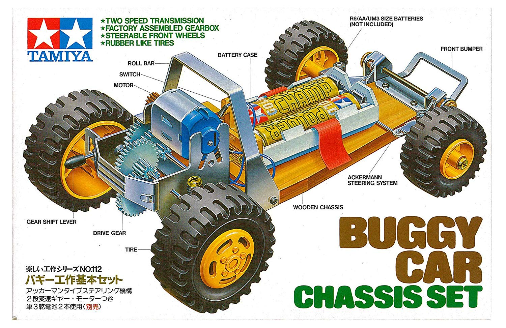
  <figcaption>Figure 1. Tamiya 70112 Buggy Car Chassis Set</figcaption>
</figure>

### Chassis - Laser Cut

Download this [pdf]() and let it be laser cutted.
One possible place to let this be done can be found [here]().

### Camera

The Camera (Figure 2) is the main sensor of the Duckiebot. All versions equip a 5 Mega Pixels 1080p camera with wide field of view fisheye lens.

<figure>
  

  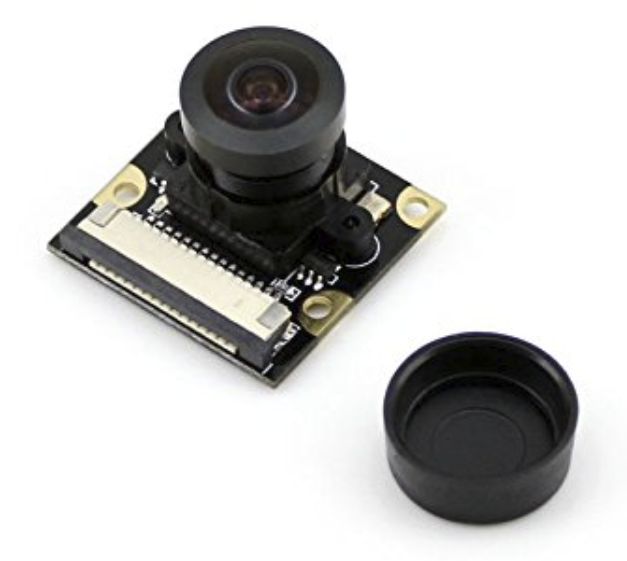
  <figcaption>Figure 3. Camera with 160-FOV Fisheye Lens</figcaption>
</figure>

### Camera Mount

The camera mount (Figure 4) serves to keep the camera looking forward at the right angle to the road (looking slightly down). The front cover is not essential.

<figure>
  

  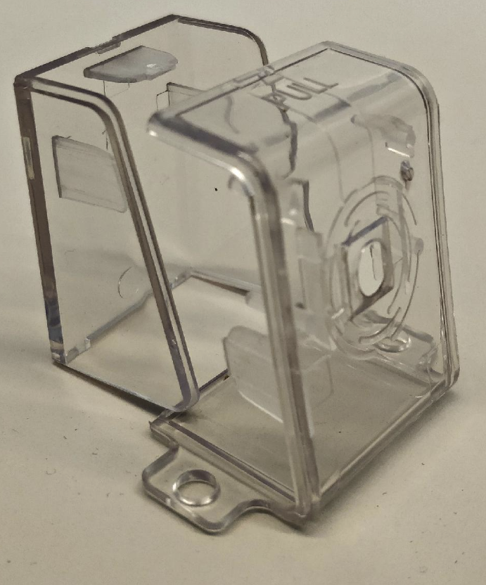
  <figcaption>Figure 4. Camera Mount</figcaption>
</figure>

 
The assembled camera (without camera cable) is shown below:
 

<figure>
  

  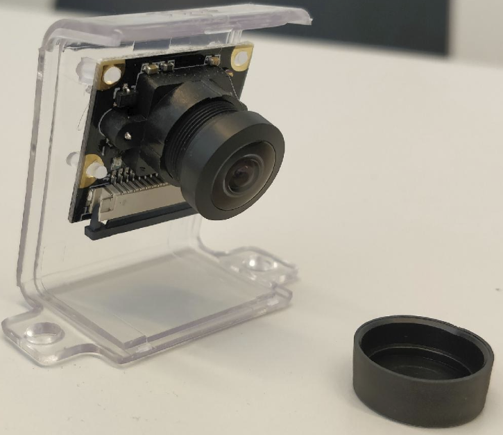
  <figcaption>Figure 5. Assembled Camera</figcaption>
</figure>

### 300mm Camera Cable

A longer (300 mm) camera cable (Figure 6) makes assembling the Duckiebot easier, allowing for more freedom in the relative positioning of camera and computational stack.

<figure>
  

  
  <figcaption>Figure 6. 300mm Camera Cable</figcaption>
</figure>

### Raspberry Pie 3 - Model B+

The Raspberry Pie is the central computer of the Duckiebot. Duckiebots use Model B+ (Figure 7) (1.4GHz 64-bit quad-core processor), a small but powerful computer.

<figure>
  

  
  <figcaption>Figure 7. Raspberry Pi 3 B+</figcaption>
</figure>

### Power supply for Raspberry Pi

We want a hard-wired power source (5VDC, 2.4A, Micro USB) to supply the Raspberry Pi while not driving. This charger (Figure 8) can double down as battery charger as well.

<figure>
  

  
  <figcaption>Figure 8. Power Supply</figcaption>
</figure>

### Microcontroller Board

### Servo Motor

The Servo Motor (Figure 10) is responsible for the steering mechanism to move. With a stall torque of 18-21 oz-in, this small motor has enough power to make the duckiebot turn even on the spot.

<figure>
  

  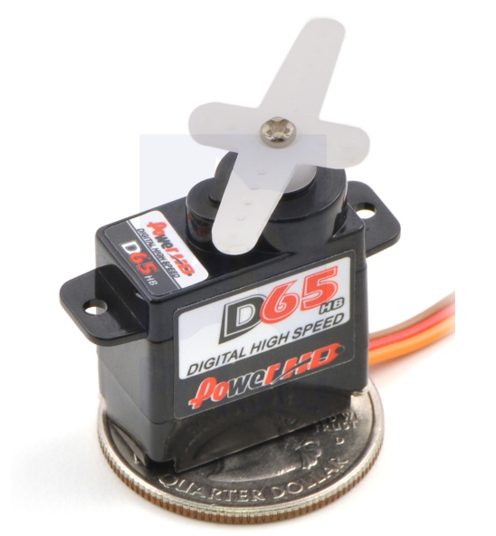
  <figcaption>Figure 10. Servo Motor</figcaption>
</figure>

### Heat Sinks

The Raspberry Pi will heat up significantly during use. It is warmly recommended to add heat sinks (Figure 11). Since we will be stacking HATs on top of the Raspberry Pi with 15 mm standoffs, the maximum height of the heat sinks should be well below 15 mm. The chip dimensions are 15x15mm and 10x10mm.

<figure>
  

  
  <figcaption>Figure 11. Heat sinks</figcaption>
</figure>

### 16 GB Class 10 MicroSD Card

The MicroSD card (Figure 12) is the hard disk of the Raspberry Pi. 16 GB of capacity are sufficient for the system image.

<figure>
  

  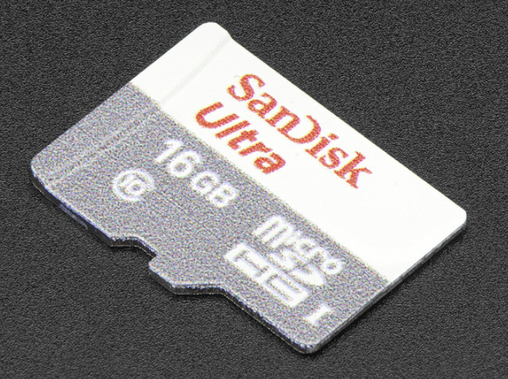
  <figcaption>Figure 12. Micro SD card reader</figcaption>
</figure>

### Micro SD card reader

A microSD card reader (Figure 13) is useful to copy the system image to a Duckiebot from a computer to the Raspberry Pi microSD card, when the computer does not have a native SD card slot.

<figure>
  

  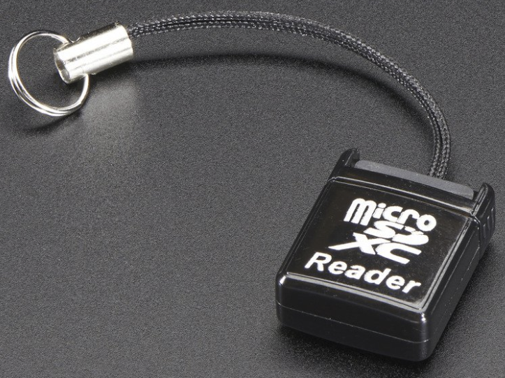
  <figcaption>Figure 13. SD card reader</figcaption>
</figure>

### Battery

The battery (Figure 14) provides power to the Duckiebot.

We choose this battery because it has a good combination of size (to fit in the lower deck of the Magician Chassis), high output amperage (3A per port at 5V DC) over two USB outputs, an okay capacity (5000 mAh) at an affordable price. The battery linked in the table above comes with one USB to microUSB cables, so another one is needed.

<figure>
  

  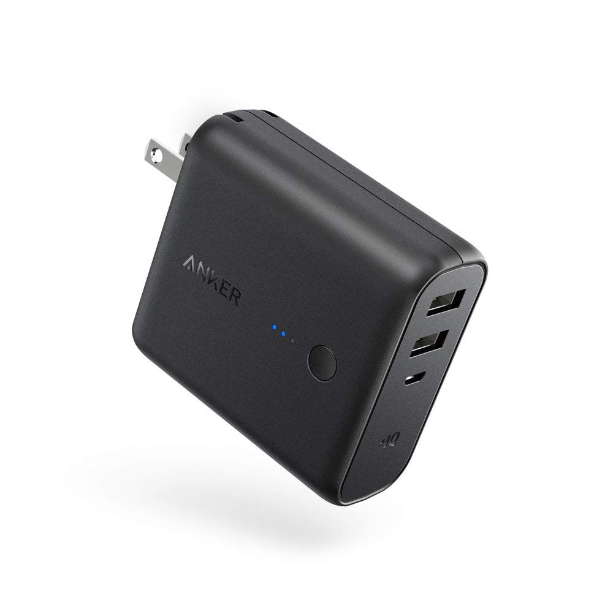
  <figcaption>Figure 14. Battery</figcaption>
</figure>

### USB to microUSB

One USB to microUSB cable (Figure 15) to connect the battery to the Microcontroller Board.

<figure>
  

  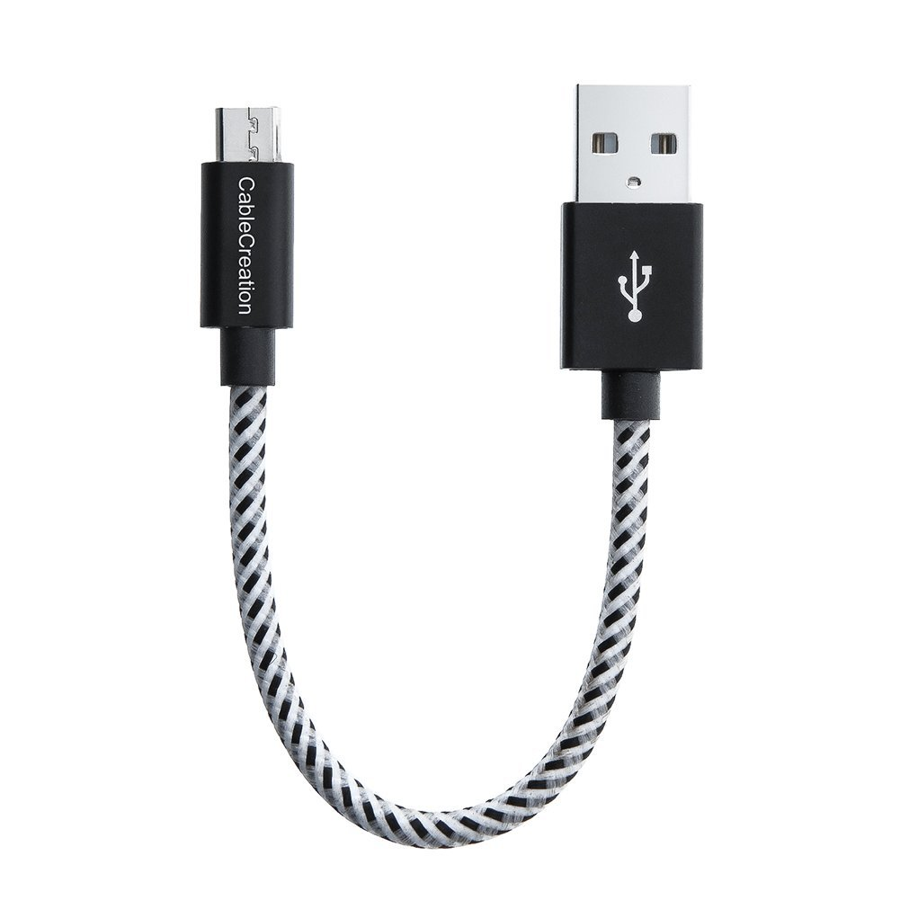
  <figcaption>Figure 15. USB to microUSB cable</figcaption>
</figure>

### Nylon components

We use non electrically conductive standoffs (M2.5 12mm F 6mm M), nuts (M2.5), and screws (M2.5x10mm)
(Figure 16) to hold the Raspberry Pi to the chassis and the HATs stacked on top of the Raspberry Pi.

The Duckiebot requires 22 standoffs, 18 Nuts and 10 screws.

<figure>
  

  
  <figcaption>Figure 16. Nylon components</figcaption>
</figure>

### Joypad

The joypad (Figure 17) is used to manually remote control the Duckiebot. Any 2.4 GHz wireless controller (with a _tiny_ USB dongle) will do.

The model linked in the table does not include batteries.

<figure>
  

  
  <figcaption>Figure 17. Joypad</figcaption>
</figure>

 
Requires: 2 AA 1.5V batteries
 

<figure>
  

  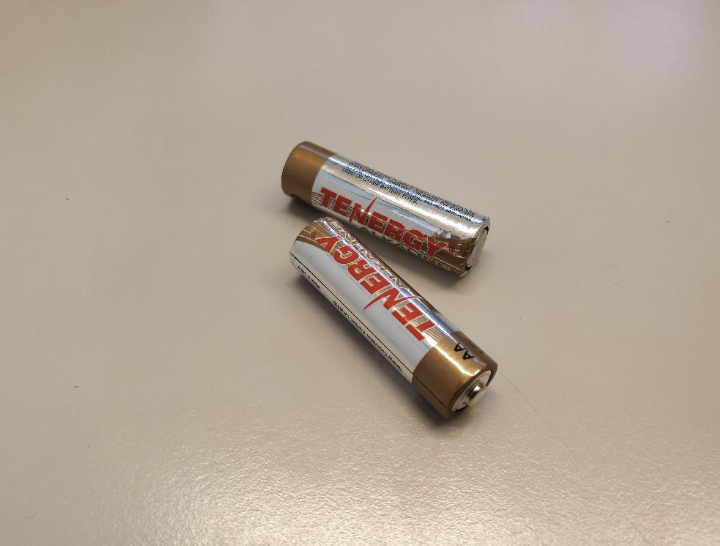
  <figcaption>Figure 18. AA 1.5V Batteries</figcaption>
</figure>

### Addressable LEDs

These adressable LEDs (Figure 19) have been selected due to their size and suitable brightness.

<figure>
  

  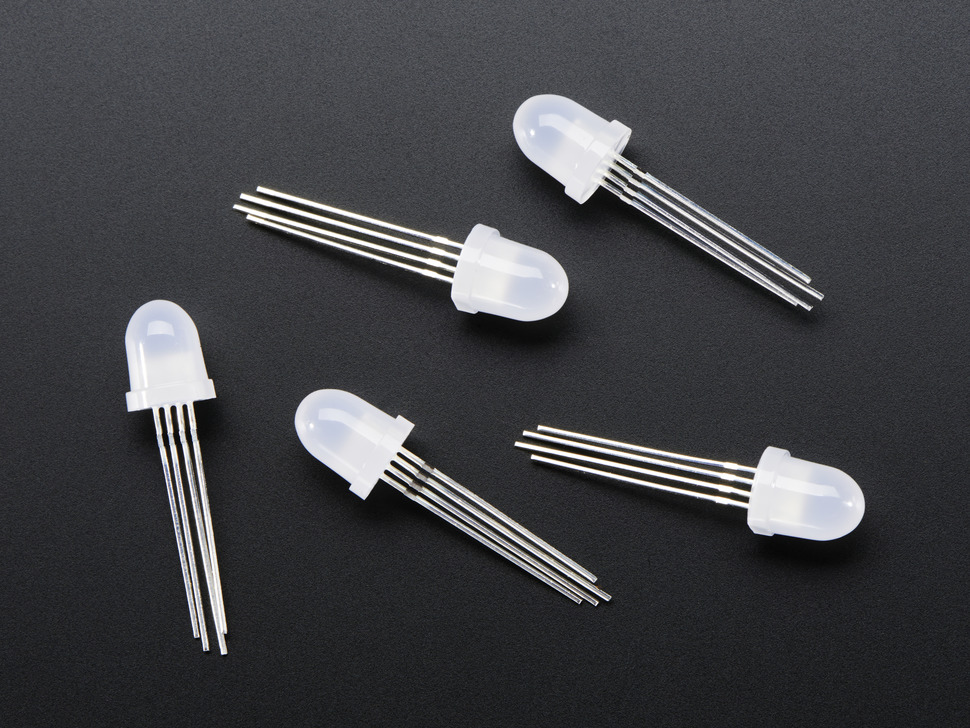
  <figcaption>Figure 19.Addressable LEDs</figcaption>
</figure>

### Male to Male Jumper Wire

2 male-male jumper wires (Figure 20) are needed to connect the Microcontroller Board to the DC-Motor.

<figure>
  

  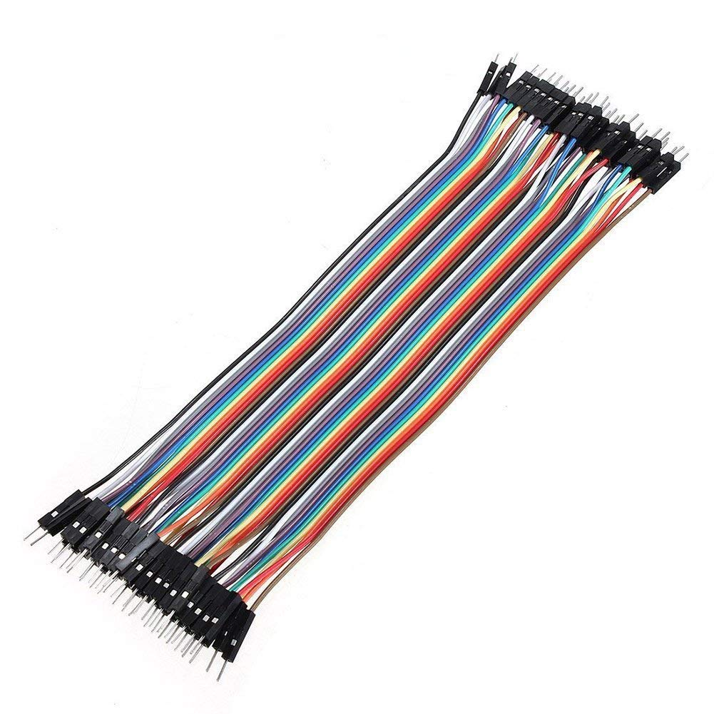
  <figcaption>Figure 20. Male to male jumper wires</figcaption>
</figure>

### Servo Wire

2 Servo Wires (Figure 21) are needed to connect the servo motor and the LEDs to the Microcontroller Board.

<figure>
  

  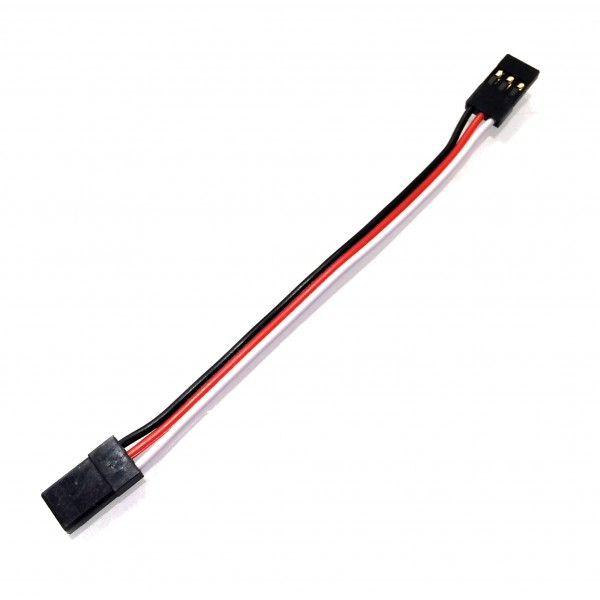
  <figcaption>Figure 21. Servo wire/Woman to woman jumper wire </figcaption>
</figure>
